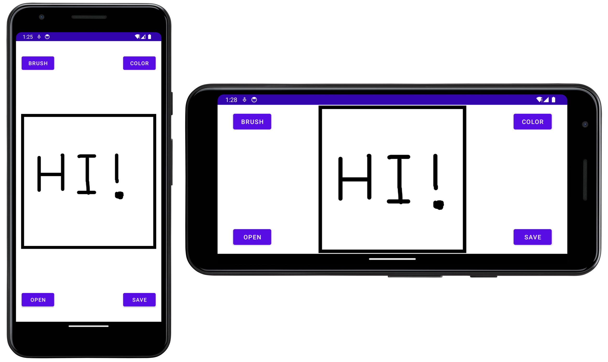
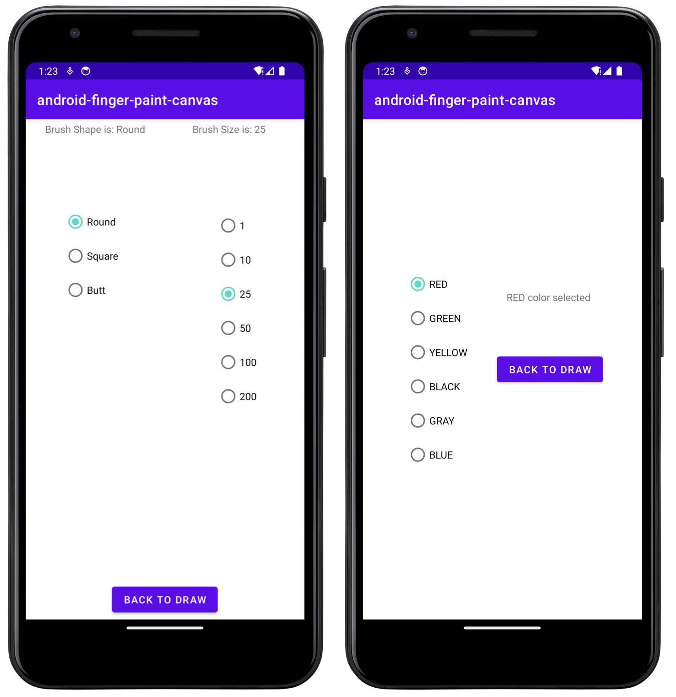
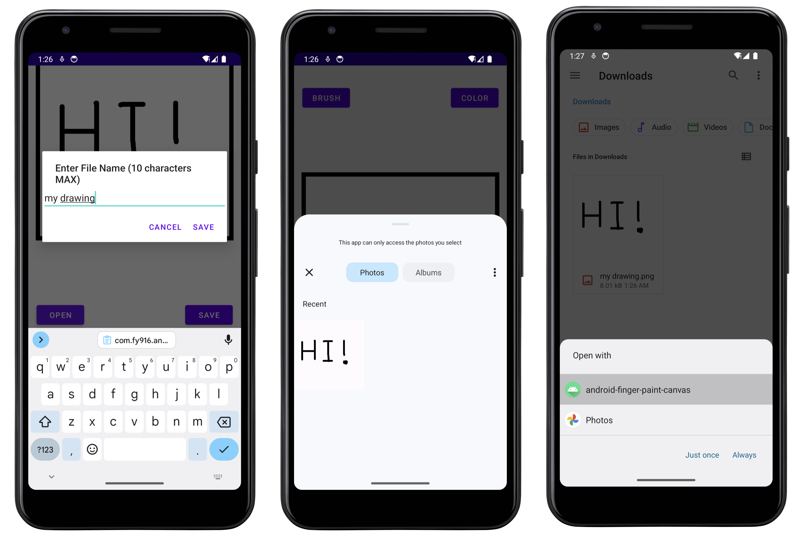

Hi there 👋, this is an android finger painter which can draw directly on the screen and save to images. You can choose the color, size and shape of the brush. You can also load existing images as the base to draw on. The following is the screenshot of this app. 

1. The drawing page of this app. The App supports horizontal screen.
   
   
   
   
   
   
   

2. The setting of the shape, size, and color of the brush
   
   

3. The app can save image to the "Downloads" Folder with specific file name. The app also supports reading from albums. Also you can directly open the app to edit a photo in the file manager. 
   
   

